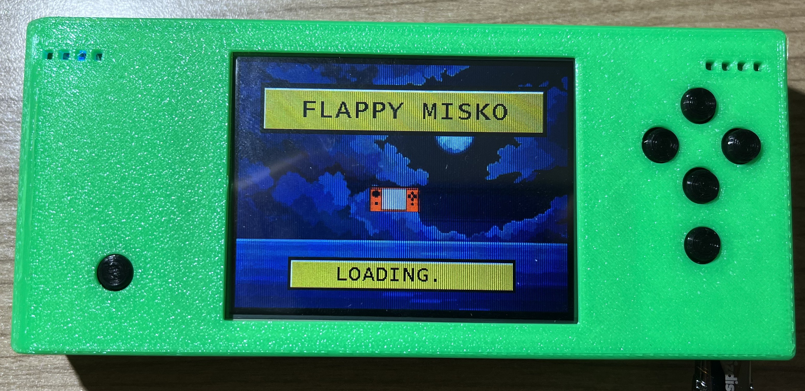
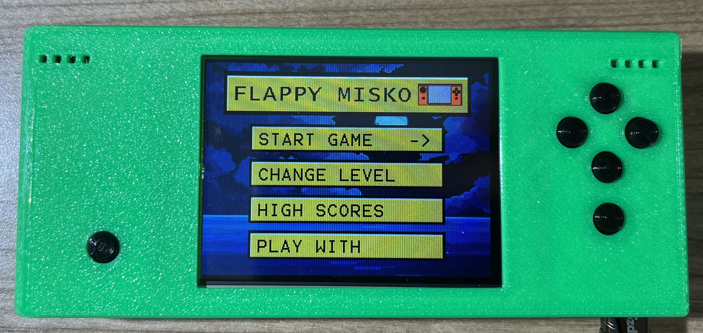
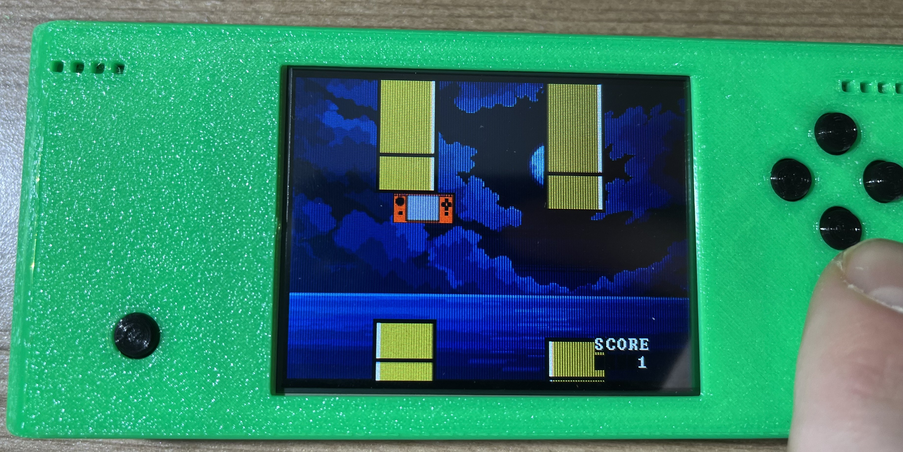

# Flappy Miško

Flappy Miško is an embedded arcade game inspired by the classic Flappy Bird, designed to run on the Miško platform. Miško 3 is a learning platform developed for students at the Faculty of Electrical Engineering in Ljubljana, featuring an STM32 microcontroller at its core.

In Flappy Miško, players take control of Miško and navigate through a series of moving obstacles. The goal is to achieve the highest score by avoiding collisions and passing through gaps. The game includes customizable difficulty levels, selectable input modes (buttons or touchscreen), a user-friendly main menu, and a high scores feature to track your best performances.

## Project Structure
```
├── 3D prints/          # 3D models and print files for hardware components
├── Firmware/           # Source code for the embedded firmware
│   ├── Application/    # Game logic, graphics, and utilities
│   ├── Core/           # STM32 HAL initialization and main application entry point
│   ├── Drivers/        # CMSIS and STM32 HAL drivers
│   ├── System/         # System utilities and additional modules
├── Images/             # Game assets such as sprites and backgrounds
```
## File Descriptions

### Firmware

- **[Application](Firmware/Application/)**: Contains game logic and rendering code.
  - `game.c`: Implements the main game loop and mechanics.
  - `graphics.c`: Handles rendering of game objects.
  - `objects.c`: Manages game objects like text and sprites.

- **[Core](Firmware/Core/)**: STM32 HAL initialization and main application entry point.
- **[Drivers](Firmware/Drivers/)**: CMSIS and STM32 HAL drivers for hardware abstraction.

All of the game code can be found in Application folder. The game code is using the functions from Core and Drivers which were written at the faculty, the original code from there can be found here: https://github.com/mjankovec/MiSKo3


### 3D Prints

- STL and SLDPRT files for 3D-printable hardware components.

### Images

- PNG files for game assets such as sprites and backgrounds.

## Gameplay screenshots

### Loading screen


### Main menu


### Gameplay


